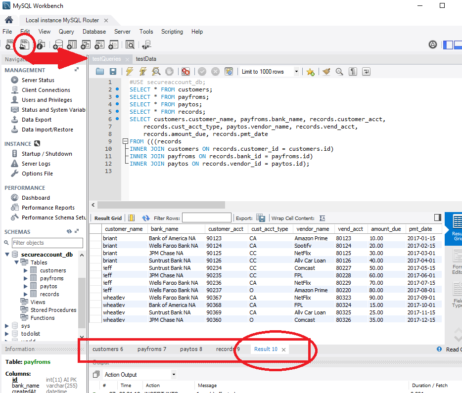

<<<<<<< HEAD
<<<<<<< HEAD
# SecurAccount
=======
# SecurAccount
>>>>>>> daefdb9eeea22f1d5b016d180bf5a01ac8a54d39
=======
#SECURACCOUNT (securaccount.com)

After creating the database in mysql workbench,
run the server, the Views will create the tables.

*Don't forget to change config.json 
to your mysql credentials

Then load and run testData.sql in mysql Workbench,
Then load and run testQueries.sql.

You should wind up with a display like this:

>>>>>>> 7afaa23608aab2d41709e4834e928010bd4f9651
